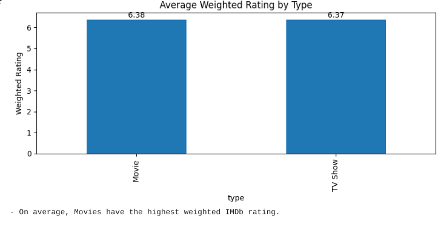
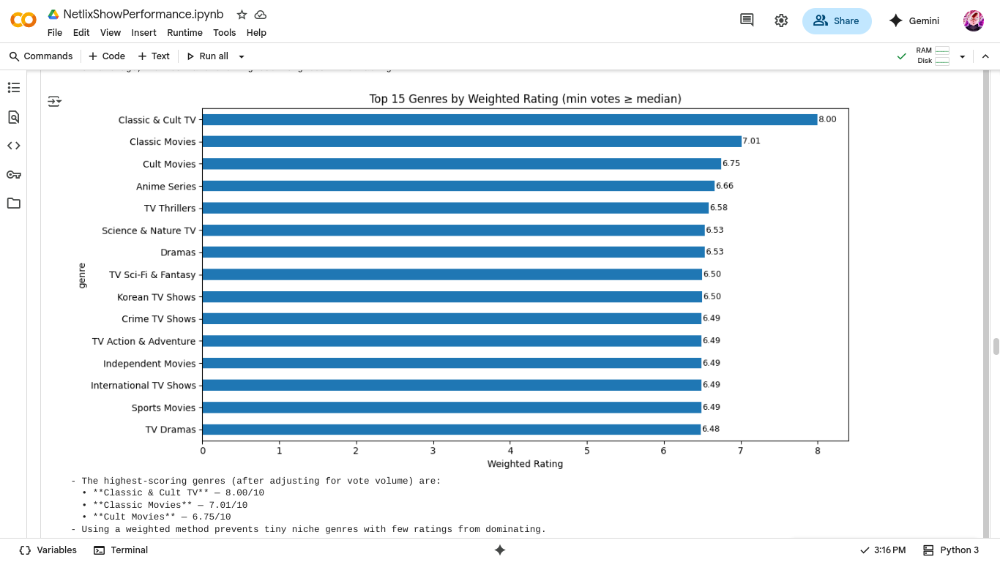
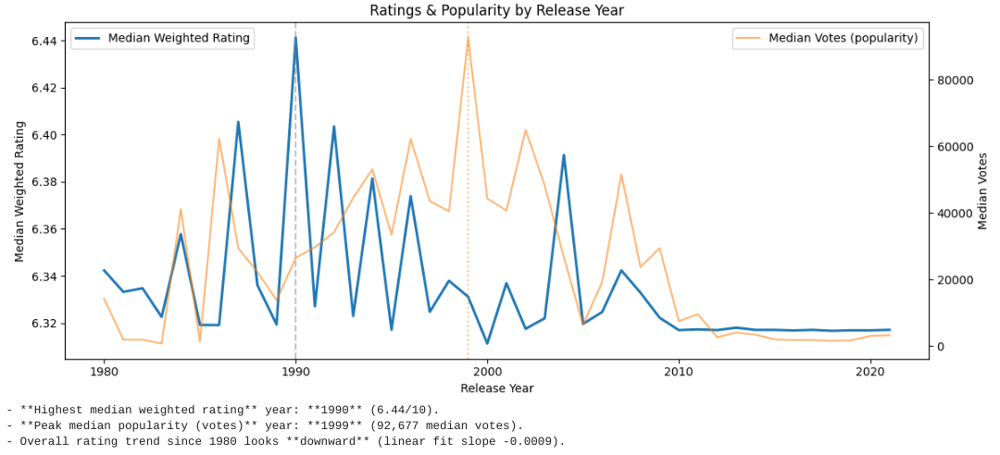
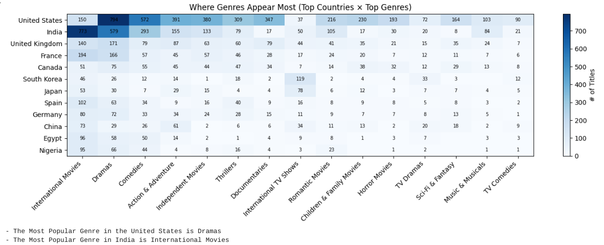
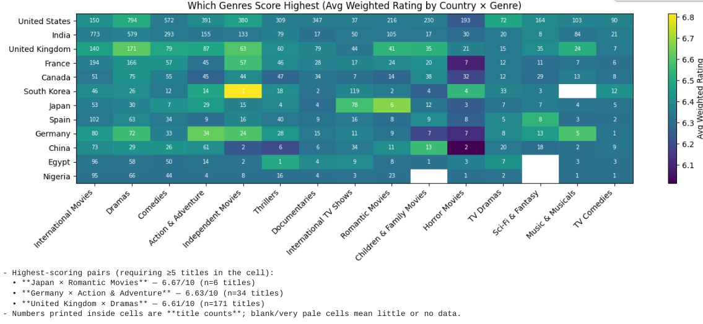

# Netflix Show Performance Analysis 🎬📊

## Project Overview
This project analyzes Netflix titles merged with IMDb ratings to uncover:
- What types of shows have the highest ratings and rewatch rate
- Patterns between release dates and popularity
- Genre trends across different countries

## Dataset Sources
- **Netflix Titles** (Kaggle dataset)  
- **IMDb Ratings + Metadata** (official IMDb non-commercial datasets)  
  - `title.basics.tsv.gz`
  - `title.ratings.tsv.gz`

Merged on `title` and `release year`.

## Skills Practiced
- Data cleaning & preprocessing
- Data merging and transformation
- Bayesian weighted rating formula
- Visualization (Matplotlib & Seaborn)
- Exploratory data analysis & storytelling

## Stakeholder Questions & Insights

### Q1: What types of shows have the highest ratings and rewatch rate?
- Used IMDb weighted rating (Bayesian adjustment).
- Engagement proxy = log of vote counts.
- **Result**: The Type Movies scored highest.  
- **The Highest Scoring Genres Are**: Classic & Cult TV with a score of 8/10, Classic Movies with a score of 7.01/10, and Cult Movies with a score of 6.75/10

---

### Q2: Are there patterns between release dates and popularity?
- Examined yearly median weighted ratings vs median vote counts (popularity).
- **Result:** Ratings peaked in the year 1990 with a median weighted rating of 6.44/10, while popularity peaked in the year 1999 with 92,677 median votes.  
- Trendline suggests downward rating trajectory since 1990.

---

### Q3: What genres trend in different countries?
- Built two heatmaps:  
  1. **Supply (counts)** — where genres appear most.  
  2. **Quality (ratings)** — which genres score highest.  
- Added annotation to the first heatmap: cell numbers = # of titles.  
- White cells = no Netflix titles for that genre-country pair.

**Result:** Genres like [Dramas] dominate in the [United States], while [International Movies] scored highly in [India].

---

## How to Reproduce
1. Download datasets (Netflix + IMDb basics + IMDb ratings).
2. Upload to Google Colab or local Jupyter.
3. Run `NetflixShowPerformance.ipynb` (all code included).  
   - Dependencies: `pandas`, `numpy`, `matplotlib`, `seaborn`.

---

## Next Steps
- Extend analysis with **rewatch proxies** (Google Trends or watch stats).
- Add **clustering** of genres by similarity.
- Build a **dashboard** for interactive exploration.

---

## Author
Brandon Mays  
Aspiring Data Engineer | Data Analytics Enthusiast
